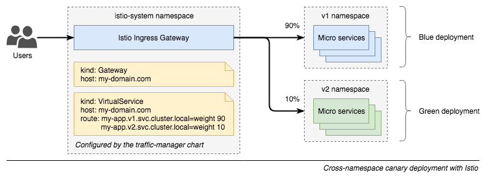

Cross-namespace canary release using Kubernetes, Istio and Helm
===============================================================

> Demo of a cross-namespace canary release using Istio service mesh with
mutual TLS enabled and Helm charts. It makes use of the new
[Istio v1alpha3 routing API](https://preliminary.istio.io/blog/2018/v1alpha3-routing.html).



## Overview

- *nginx*: Nginx chart and a custom Nginx container.
- *servcices*: for the sake of simplicity Nginx is used in this demo. You could
  setup multiple microservices as sub-chart in this directory.
- *traffic-manager*: chart with all the Istio configuration.

## Getting started

### Requirements

- [Docker](http://docker.io/)
- [Minikube](https://github.com/kubernetes/minikube)
- [Helm](https://helm.sh)

### Prepare, release Istio and both services side-by-side

First we need to start Minikube and Helm Tiller. Since Istio is going to be
deployed with the automatic sidecar injector, we need to enable some flag on the
API and bump a bit the resources:

```
$ minikube start \
    --extra-config=controller-manager.ClusterSigningCertFile="/var/lib/localkube/certs/ca.crt" \
    --extra-config=controller-manager.ClusterSigningKeyFile="/var/lib/localkube/certs/ca.key" \
    --extra-config=apiserver.Admission.PluginNames=NamespaceLifecycle,LimitRanger,ServiceAccount,PersistentVolumeLabel,DefaultStorageClass,DefaultTolerationSeconds,MutatingAdmissionWebhook,ValidatingAdmissionWebhook,ResourceQuota \
    --kubernetes-version=v1.9.0 --memory 8192 --cpus 2
$ helm init --upgrade
```

Then build and deploy Istio and the services:

```
$ make
```

The above command deploy Istio into the istio-system namespace with mTLS
enabled. Then deploy both services-v1 and services-v2 into their respective
namespaces. In a real world you would define a set of applications with
different version but in our case this is a demo so to keep it simple we use
the same container.

```
$ kubectl get svc,po -n services-v1
NAME             TYPE        CLUSTER-IP     EXTERNAL-IP   PORT(S)   AGE
service/search   ClusterIP   10.108.0.255   <none>        80/TCP    41m

NAME                          READY     STATUS    RESTARTS   AGE
pod/search-6b8cc5d6f7-pzwcb   2/2       Running   0          41m
```

To test if the release was successful:

```
$ ingress_gateway=$(minikube service istio-ingressgateway -n istio-system --url | head -n1)
$ curl $ingress_gateway -H 'Host: search.local'
Host: search-77f9697d44-l8dtc
```

### Release canary

In the section above, we released both services-v1 and services-v2 into their
respective namespace, but only services-v1 is receiving traffic. Let's shift
10% of the traffic to the services-v2 release:

```
$ helm upgrade -i traffic-manager \
    --set canary.enabled=true \
    ./traffic-manager
```

If you check the logs or if you query the endpoint you should be able to see
the traffic being shifted between the 2 version.

```
$ ingress_gateway=$(minikube service istio-ingressgateway -n istio-system --url | head -n1)
$ while sleep 0.1; do curl $ingress_gateway -v -H 'Host: search.local'; done
Host: search-77f9697d44-l8dtc
Host: search-77f9697d44-l8dtc
Host: search-77f9697d44-l8dtc
Host: search-77f9697d44-l8dtc
Host: search-77f9697d44-l8dtc
Host: search-77f9697d44-l8dtc
Host: search-6b8cc5d6f7-pzwcb
Host: search-77f9697d44-l8dtc
Host: search-77f9697d44-l8dtc
```

### Access new release using headers

If you don't want live traffic to end-up in the new version, you can enable the
`matchHeaderOnly` flag which only allow traffic with the header
`X-Track: canary` to be shifted to the services-v2 namespace.

```
$ helm upgrade -i traffic-manager \
    --set canary.enabled=true \
    --set canary.onlyMatchHeader=true \
    ./traffic-manager
$ ingress_gateway=$(minikube service istio-ingressgateway -n istio-system --url | head -n1)
$ curl $ingress_gateway -v -H 'Host: proxy.local' -H 'X-Track: canary'
```
